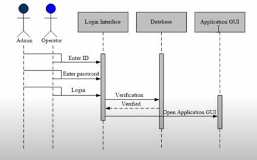

# Java-Spring-MVC-based-PM-app

A local company is needing a new tool to manage the multiple projects currently in development
The main idea is to allow project leaders to track and manage projects, tasks, and team members. 

* Barika Project management software

* Project technical documentation

* 1.  Introduction 

## Development team: Guillermo Barros, Luc Anthony Nkounkou 

## Reviewer: Hamit Pena

## Overview

This document explains the main structure and design of Barika project management software illustrated below.  

* 2.  Context

Barika is Java (Spring MVC) based web application developed to help a local company in need of a new tool to manage multiple projects, tasks, and team members. 

The tool will be used by different teams in the company which include administrators, project managers and team members. Each project should be created by an administrator and assigned to a project manager. The project manager will create tasks and assign them to team members. 

                                   

                        

* 3.  Goal & Non-Goal

The user driven impact of the project.  For the non-goal we clearly describe which problems we won’t be fixing just to get everyone on the same page.
The goal of this project is to facilitate the collaboration and coordination of projects, tasks and members inside of the company. The functionalities are as follow: 

 

 
 
 

* 4. Our solution  

A full stack spring MVC web application. 

## Database  

a.	DB Schema

 
 

b.	MySQL database

 

## Authentication 

c.	System login [Spring Security module]

 

## System Architecture

d.	Models

 

e.	DAO (Data Access Objects)

 

f.	Controllers

 
 

g.	Spring Security (Authentication & Authorization)
 

h.	Back-end Configuration
 

* 5.   Feedbacks & Discussion 

Any issue experienced with the app should be sent @:  lucbarika@gmail.com

Also, new feature request can be submitted, and a technical evaluation will be done in order decide if the feature can be implemented or not. 

* 6. Project scope & timeline

